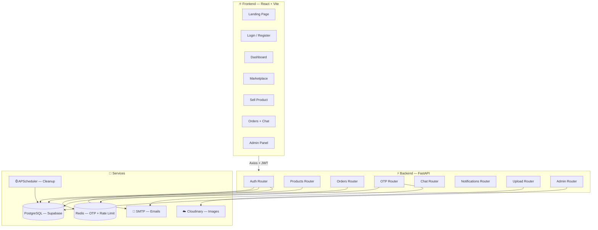
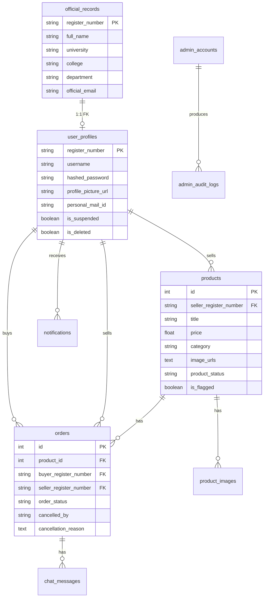

<div align="center">

<!-- Animated Header -->


<!-- Badges Row 1 -->
<p>
  
  
  
  
</p>

<!-- Badges Row 2 -->
<p>
  
  
  
  
</p>

<!-- One-liner -->
<h3>🎓 A closed-ecosystem marketplace where every buyer and seller is a verified university student.</h3>

<p>
  <a href="#-features">Features</a> •
  <a href="#%EF%B8%8F-architecture">Architecture</a> •
  <a href="#-tech-stack">Tech Stack</a> •
  <a href="#-getting-started">Setup</a> •
  <a href="#-api-reference">API</a> •
  <a href="#-deployment">Deploy</a>
</p>

<br/>

</div>

---

## 🔥 Why UNIMART?

> Traditional marketplaces have **zero identity verification**. Anyone can scam, ghost, or catfish. UNIMART is different.

| Problem | UNIMART Solution |
|---------|-----------------|
| Anonymous sellers | 🎓 **Verified students only** — matched against official university registry |
| No delivery proof | 🔐 **OTP handshake** — buyer confirms receipt with a 6-digit code |
| Spam & bot accounts | 🛡️ **Email OTP registration** — only official university emails accepted |
| No accountability | 📋 **Full audit trail** — every action is logged and traceable |
| Unsafe transactions | 🤝 **Campus-only** — all trades happen between verified peers |

---

## ✨ Features

### 👤 Student Portal

- **Registry-Verified Signup** — Only students in the official CSV master registry can create accounts
- **Email OTP Verification** — Registration requires SMTP-delivered OTP to personal email
- **JWT Auth + Refresh Tokens** — Secure session management with automatic token refresh
- **Profile Management** — Avatar upload (Cloudinary), username changes (tracked), personal details
- **Dark/Light Theme** — Full theme toggle with persistent preference

### 🏪 Marketplace

- **Product Listings** — Multi-image upload via Cloudinary, 13 curated categories
- **Advanced Filtering** — Search, category filter, price sort, condition filter
- **Real-Time Status** — Products auto-transition: `AVAILABLE → RESERVED → SOLD_OUT → DELETED`
- **Image Cropper** — Built-in image cropping tool before upload

### 📦 Order System

- **4-Stage Order Flow** — `PENDING → CONFIRMED → COMPLETED` (or `CANCELLED`)
- **OTP Delivery Verification** — Seller generates OTP → sent to buyer's email → seller verifies on handoff
- **Cancellation Tracking** — Reason required, cancelled-by party recorded, product auto-released
- **In-App Chat** — Per-order messaging between buyer and seller (auto-deletes 24h after completion)

### 🔔 Notifications

- **Real-Time Bell** — In-app notification center with unread count badge
- **Event-Driven** — Notifications for order placed, confirmed, cancelled, completed
- **Mark Read/Unread** — Individual and bulk notification management

### 🛡️ Admin Panel *(Matrix-themed hacker UI)*

- **Dashboard Analytics** — Total users, products, orders, 7-day trends
- **User Management** — Search, suspend, reinstate, soft-delete users
- **Product Moderation** — Flag, status override, force-delete with FK cascade
- **Order Override** — Admin can force-complete or cancel any order
- **Audit Logs** — Every admin action logged with IP, timestamp, before/after state
- **User Activity Logs** — Track login, registration, and order events

---

## 🏗️ Architecture



### 📊 Database Schema



---

## 🛠 Tech Stack

### Frontend
| Technology | Purpose |
|-----------|---------|
| **React 18** | UI framework with hooks and context API |
| **Vite 5** | Lightning-fast HMR dev server and build tool |
| **TailwindCSS 3** | Utility-first responsive styling |
| **React Router 6** | Client-side routing with protected routes |
| **Axios** | HTTP client with interceptors for JWT refresh |
| **Lucide React** | Modern icon library |

### Backend
| Technology | Purpose |
|-----------|---------|
| **FastAPI** | Async Python web framework with auto-docs |
| **SQLAlchemy 2** | ORM with relationship mapping |
| **PostgreSQL (Supabase)** | Production database with connection pooling |
| **Redis** | OTP storage (TTL-based) + sliding-window rate limiting |
| **Cloudinary** | Image upload, transformation, and CDN delivery |
| **APScheduler** | Background jobs (sold-product cleanup, chat expiry) |
| **PyJWT + BCrypt** | JWT token auth + password hashing |
| **Alembic** | Database migrations |
| **SMTP (smtplib)** | Transactional emails (OTP, delivery, completion) |

---

## 🚀 Getting Started

### Prerequisites

- **Python** 3.10+
- **Node.js** 18+
- **Redis** server running locally or remotely
- **PostgreSQL** database (Supabase recommended)
- **Cloudinary** account (free tier works)

### 1️⃣ Clone the Repository

```bash
git clone https://github.com/numankhan2007/UNIMART.git
cd UNIMART
```

### 2️⃣ Backend Setup

```bash
cd backend

# Create virtual environment
python -m venv venv
source venv/bin/activate  # Windows: venv\Scripts\activate

# Install dependencies
pip install -r requirements.txt

# Configure environment
cp .env.example .env
# Edit .env with your credentials (see .env.example for reference)

# Seed official records (first time only)
python seed_data.py

# Start the server
uvicorn main:app --reload --port 8000
```

### 3️⃣ Frontend Setup

```bash
cd frontend

# Install dependencies
npm install

# Configure environment
echo "VITE_API_URL=http://localhost:8000" > .env.local

# Start dev server
npm run dev
```

### 4️⃣ Access the App

| URL | Description |
|-----|-------------|
| `http://localhost:5173` | 🏠 Landing Page |
| `http://localhost:5173/login` | 🔐 Student Login |
| `http://localhost:5173/admin/login` | 🖥️ Admin Panel *(hidden — no UI link)* |
| `http://localhost:8000/docs` | 📖 FastAPI Swagger Docs |

---

## 📡 API Reference

### Authentication
| Method | Endpoint | Description |
|--------|---------|-------------|
| `GET` | `/api/auth/verify/{register_number}` | Verify register number exists in registry |
| `POST` | `/api/auth/send-registration-otp` | Send registration OTP to email |
| `POST` | `/api/auth/verify-registration-otp` | Verify registration OTP |
| `POST` | `/api/auth/register` | Register new student account |
| `POST` | `/api/auth/login` | Login with register number or username |
| `POST` | `/api/auth/refresh` | Refresh access token |
| `GET`  | `/api/auth/profile` | Get current user profile |
| `PUT`  | `/api/auth/profile` | Update profile (avatar, username, etc.) |

### Products
| Method | Endpoint | Description |
|--------|---------|-------------|
| `GET`    | `/api/products` | List products (with filters) |
| `POST`   | `/api/products` | Create new product listing |
| `GET`    | `/api/products/{id}` | Get product details |
| `PUT`    | `/api/products/{id}` | Update product |
| `DELETE` | `/api/products/{id}` | Delete product |

### Orders
| Method | Endpoint | Description |
|--------|---------|-------------|
| `POST` | `/api/orders` | Create order (buyer) |
| `GET`  | `/api/orders/buyer` | List buyer's orders |
| `GET`  | `/api/orders/seller` | List seller's orders |
| `PUT`  | `/api/orders/{id}/status` | Update order status |
| `POST` | `/api/orders/{id}/cancel` | Cancel with reason |

### OTP Delivery
| Method | Endpoint | Description |
|--------|---------|-------------|
| `POST` | `/api/otp/generate` | Generate 6-digit delivery OTP |
| `POST` | `/api/otp/send-email` | Email OTP to buyer |
| `POST` | `/api/otp/verify` | Verify OTP → complete transaction |

### Chat & Uploads
| Method | Endpoint | Description |
|--------|---------|-------------|
| `GET`  | `/api/chat/{order_id}` | Get chat messages |
| `POST` | `/api/chat/{order_id}` | Send chat message |
| `POST` | `/api/upload/image` | Upload single image |
| `POST` | `/api/upload/images` | Upload multiple images |

### Admin *(JWT protected)*
| Method | Endpoint | Description |
|--------|---------|-------------|
| `POST`   | `/api/admin/auth/login` | Admin login |
| `GET`    | `/api/admin/dashboard/stats` | Dashboard analytics |
| `GET`    | `/api/admin/users` | List/search users |
| `PATCH`  | `/api/admin/users/{id}` | Edit user |
| `POST`   | `/api/admin/users/{id}/suspend` | Suspend user |
| `DELETE` | `/api/admin/products/{id}` | Force-delete product |
| `PATCH`  | `/api/admin/orders/{id}/status` | Override order status |
| `GET`    | `/api/admin/audit-logs` | View admin audit trail |
| `GET`    | `/api/admin/registry` | List/search student registry |
| `POST`   | `/api/admin/registry/import` | Import CSV to student registry |

---

## 🔒 Security

| Layer | Implementation |
|-------|---------------|
| **Password Hashing** | BCrypt with salt rounds |
| **Authentication** | JWT access tokens (30min) + refresh tokens |
| **Rate Limiting** | Redis sliding-window (strict: 5/min for auth, relaxed: 200/min) |
| **OTP Security** | Redis-only storage (no DB), 10min TTL, 5 max attempts |
| **Image Validation** | Cloudinary-only URLs allowed (`ALLOWED_IMAGE_HOSTS` whitelist) |
| **CORS** | Configurable allowed origins |
| **Input Validation** | Pydantic v2 field validators on all endpoints |
| **Admin Isolation** | Separate JWT secret, separate auth context, no UI entry point |
| **Audit Trail** | Every admin action logged with IP and details |
| **XSS/Clickjack** | `X-Content-Type-Options`, `X-Frame-Options`, `Referrer-Policy` headers |

---

## ⏰ Background Jobs

| Job | Interval | Description |
|-----|----------|-------------|
| **Product Cleanup** | Every 24h | Soft-deletes `SOLD_OUT` products older than 7 days |
| **Chat Cleanup** | Every 1h | Removes chat messages from orders completed 24h+ ago |

---

## 🌐 Deployment

### Frontend → Vercel

```bash
cd frontend
npm run build
# Deploy via Vercel CLI or GitHub integration
# vercel.json handles SPA rewrites + security headers
```

### Backend → Render / Railway

```bash
# Procfile or start command:
uvicorn main:app --host 0.0.0.0 --port $PORT
```

### Infrastructure Checklist

- [ ] Supabase PostgreSQL provisioned
- [ ] Redis instance (Upstash / Railway Redis)
- [ ] Cloudinary account configured
- [ ] SMTP credentials (Gmail App Password)
- [ ] All `SECRET_KEY` values are 32+ chars
- [ ] `CORS_ORIGINS` set to frontend domain
- [ ] `APP_ENV=production` set
- [ ] Official records CSV seeded

---

## 📁 Project Structure

```
UNIMART/
├── backend/
│   ├── main.py                 # FastAPI app entry, lifespan, middleware
│   ├── database.py             # SQLAlchemy engine + session
│   ├── models.py               # 8 ORM models (User, Product, Order, Chat, etc.)
│   ├── schemas.py              # Pydantic request/response schemas
│   ├── security.py             # JWT + BCrypt utilities
│   ├── dependencies.py         # Auth dependency injection
│   ├── settings.py             # Environment helpers
│   ├── redis_client.py         # Redis connection manager
│   ├── scheduler.py            # APScheduler background jobs
│   ├── seed_data.py            # Official records CSV seeder
│   ├── admin_auth.py           # Admin JWT + seed logic
│   ├── admin_models.py         # AdminAccount + AuditLog models
│   ├── admin_schemas.py        # Admin Pydantic schemas
│   ├── routers/
│   │   ├── auth.py             # Registration, login, profile
│   │   ├── products.py         # CRUD + status management
│   │   ├── orders.py           # Order lifecycle + cancellation
│   │   ├── otp.py              # OTP generate/verify/email
│   │   ├── chat.py             # Per-order messaging
│   │   ├── notifications.py    # In-app notification system
│   │   ├── upload.py           # Cloudinary image uploads
│   │   └── admin.py            # Full admin management suite
│   ├── middleware/
│   │   └── rate_limit.py       # Redis sliding-window rate limiter
│   ├── services/
│   │   └── email_service.py    # SMTP email templates
│   └── .env.example            # Environment template
│
├── frontend/
│   ├── src/
│   │   ├── App.jsx             # Root with providers + routing
│   │   ├── pages/              # 14 page components
│   │   │   ├── Landing.jsx     # Public landing page
│   │   │   ├── Login.jsx       # Student login
│   │   │   ├── Register.jsx    # Multi-step registration
│   │   │   ├── Home.jsx        # Marketplace browse
│   │   │   ├── Dashboard.jsx   # User profile + stats
│   │   │   ├── SellProduct.jsx # Product listing form
│   │   │   ├── Orders.jsx      # Order management
│   │   │   └── ChatPage.jsx    # Per-order chat
│   │   ├── components/
│   │   │   ├── common/         # Badge, Button, Modal, Toast, etc.
│   │   │   ├── layout/         # Navbar, Footer, MobileNav
│   │   │   ├── product/        # ProductCard, Filters, Grid
│   │   │   ├── order/          # OTPModal, OrderModal, CancelModal
│   │   │   └── dashboard/      # BuyHistory, SellHistory, MyProducts
│   │   ├── admin/              # Standalone admin SPA
│   │   │   ├── AdminApp.jsx    # Admin routing
│   │   │   ├── pages/          # Dashboard, Users, Products, Orders, AuditLogs
│   │   │   └── components/     # AdminLayout, AdminTable, AdminToast
│   │   ├── context/            # Auth, Theme, Order, Chat, Notification
│   │   ├── services/           # Axios API client
│   │   ├── constants/          # Categories, campuses, order status
│   │   ├── hooks/              # useBackNavigation
│   │   └── utils/              # Helper functions
│   ├── vercel.json             # Deployment config
│   └── tailwind.config.js      # Theme customization
│
├── LICENSE                     # Apache 2.0
└── README.md                   # You are here
```

---

## 🤝 Contributing

1. **Fork** the repository
2. Create a feature branch: `git checkout -b feature/amazing-feature`
3. Commit your changes: `git commit -m "Add amazing feature"`
4. Push to the branch: `git push origin feature/amazing-feature`
5. Open a **Pull Request**

---

## 📄 License

This project is licensed under the **Apache License 2.0** — see the [LICENSE](LICENSE) file for details.

---

<div align="center">


**Built with 💙 for university students, by university students.**

<sub>UNIMART © 2026 • <a href="https://github.com/numankhan2007/UNIMART">github.com/numankhan2007/UNIMART</a></sub>

</div>

